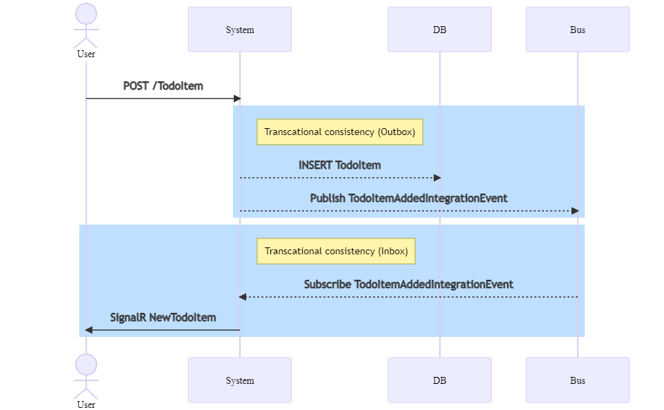
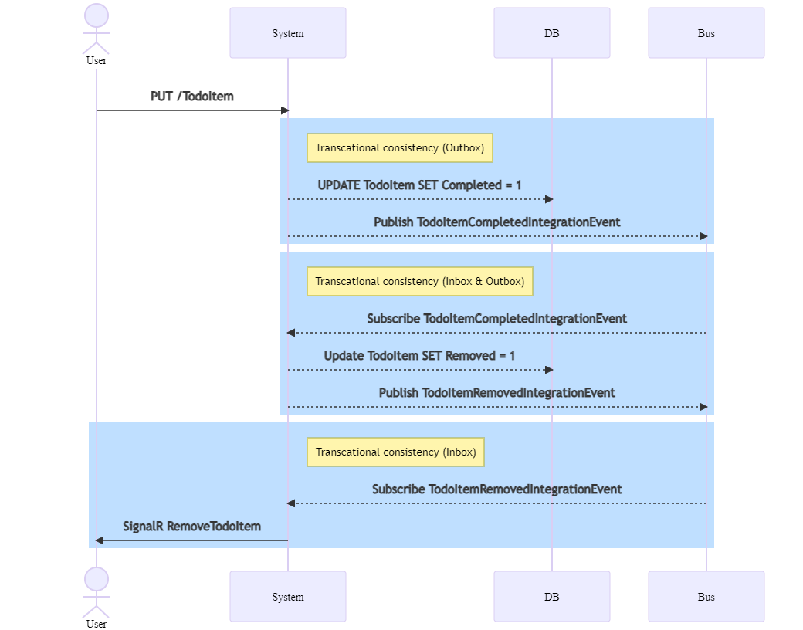
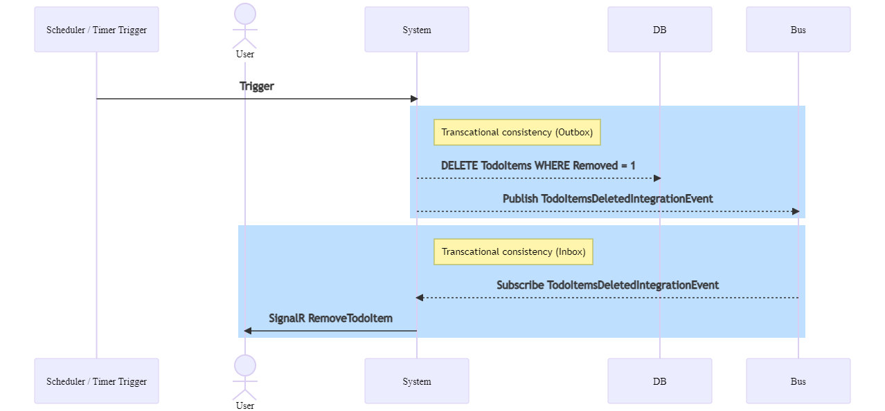

# Self Contained System - Proof of Concept

* Tactical Domain Driven Design Patterns (Aggregate Root, Entities, Value Objects, Domain Events, Repository)
* Unit Of Work Pattern & Optimistic Concurrency
* Messaging via NServiceBus
* Outbox Pattern (`NServiceBusOutbox` & `HangfireOutbox`)
* Integration Tests

## Use Cases

### UC1: Add TodoItem

> Database modification and message publish should happen transactionally. 
> Therefore an Outbox is implemented.

### UC2: Complete TodoItem

> The second transaction requires an outbox implementation which is connected 
> to the subscribing message for deduplication.

### UC3: Remove Deleted TodoItems

> Simmilar to UC1 but this time we are not in a htttp context.

## TODO

* SendLocal prüfen
* Sagas prüfen
* Dapper sql command + transaction
* AggregateConcurrency Exception in einem MediatR Behavior handeln und Polly-Retries auslösen

## Tests ausführen

1. `docker-compose up`
2. Tests mit Visual Studio ausführen

## Zuständigkeiten

* `Web` bietet eine REST API an. Dieses Projekt publiziert Events (bzw. schreibt diese in die Outbox) und abonniert Events vom Bus um SingalR Notifizierungen auszulösen.
* `Worker` ist ein Web API Projekt aber dient als Background Worker. Der Worker Service publiziert und abonniert Events. Zudem werden Hangfire Jobs (wie bspw. die Outbox) vom Worker abgearbeitet.

### Outbox Problematik

NServiceBus bietet mit ihrer Outbox bereits eine Lösung für solche Konsiszentprobleme an. Das Problem ist jedoch, 
dass diese ausschliesslich im Zusammenhand mit einer Inbox funktioniert. Mit aktivieren der Outbox ist also nur die 
Konsistenz zwischen DB und NSB im Message Handler Kontext (Event -> DB -> Event) gelöst.

Hier einige links dazu:
* https://docs.particular.net/samples/router/update-and-publish/
* https://discuss.particular.net/t/outbox-in-an-asp-net-core-scenario/966/6

> Im Moment gibt es mehrere Lösungsansätze:
> * [`NServiceBus.Router`](https://docs.particular.net/nservicebus/router/) ist ein Community Projekt und hat keinen offiziellen NSB support.
> * [`NServiceBus.Connector.SqlServer`](https://www.nuget.org/packages/NServiceBus.Connector.SqlServer) basiert auf `NServiceBus.Router` und vereinfacht dessen Handhabung
> * [`https://github.com/peto268/NServiceBus.WebOutbox`](https://github.com/peto268/NServiceBus.WebOutbox) 
> * [`NServiceBus.Transport.Bridge`](https://docs.particular.net/nservicebus/bridge/) ist eine offiziell supportete NSB Komponente, momentan existiert jedoch nur eine preview Version.
> * Outbox via Hangfire selbst implementieren
